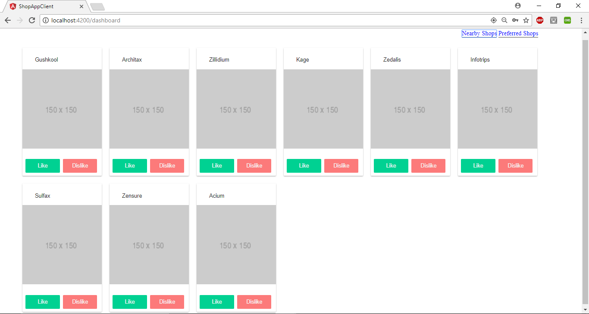

# ShopWebApp

> web app to find and diplay nearby shops

This web application help its users to find and show nearby shops, by taking the current location of its users and displaying all the shops arround sorted by distance.

---

## Features
- Take user's current location.
- A User can sign up using my email & password
- A User can sign in using my email & password
- A User can display the list of shops sorted by distance
- A User can like a shop, so it can be added to my preferred shops
- - Acceptance criteria: liked shops shouldn’t be displayed on the main page
- A User can dislike a shop, so it won’t be displayed within “Nearby Shops” list during the next 2 hours 
- A User can display the list of preferred shops
- A User can remove a shop from my preferred shops list
- Material Design

## Setup

### Application Data

A MongoDB dump with ~300 shops is provided. To import the data, you need to extract the zip file then execute the command below :
 
 
    mongorestore --db shops shops/

create a 2dsphere index 

`> db.shops.createIndex( { location : "2dsphere" } )`

→→ A shop database will be created with a shops collection.

→ → Dump File : [here](dump-shops.zip)

### ShopAppServer

This project is a maven springboot project generated by spring boot initializer.
After you clone this repo to your desktop import shop-app-server folder in you preferred IDE and run it

### ShopAppClient

This project was generated with [Angular CLI](https://github.com/angular/angular-cli) version 1.6.2.

####  Run the client app in development mode 

 In the terminal, navigate to shop-app-client folder, run `ng serve` for a dev server. Navigate to `http://localhost:4200/`. The app will automatically reload if you change any of the source files.
